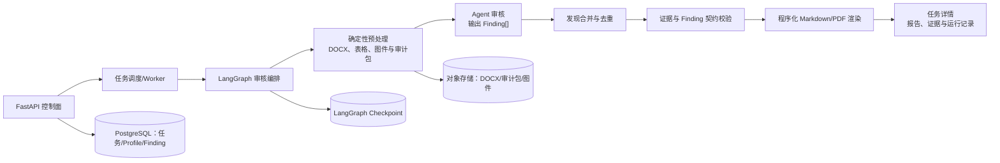

# DocGuard

面向 DOCX 技术文档的证据驱动审核服务骨架。它坚持一条边界：**agent 只输出结构化审核判断 `Finding[]`；程序负责文件处理、流程控制、证据校验与最终报告。**

当前版本是可启动的本地开发框架：默认使用确定性的 `stub` 审核执行器，因此不会调用模型或读取 DOCX 内容。它刻意保留了 OpenClaw 和 LangChain 两个适配边界，后续接入时不会改变 API、LangGraph 或报告契约。

## 技术架构



### 分层职责

| 层 | 职责 | 当前实现 | 生产替换 |
| --- | --- | --- | --- |
| FastAPI | 创建任务、查询状态、鉴权、展示下载 | `api/app.py` | 保持接口，补鉴权与分页 |
| Worker | 领取长任务、重试、限流、租约 | FastAPI `BackgroundTasks` 演示实现 | 独立 worker + Redis/RabbitMQ/云队列 |
| LangGraph | 节点编排、失败恢复、人工暂停恢复 | `graph/audit_graph.py` | `PostgresSaver` checkpoint |
| 预处理 | 接受修订、DOCX/表格/图件提取、审计包 | 占位节点 | 独立确定性 DOCX 管线 |
| AgentGateway | 只读审计包，返回 `Finding[]` | Stub/OpenClaw/LangChain 接口 | JSON schema 强制输出 |
| 存储 | 元数据、产物与原始响应 | 内存 store | PostgreSQL + S3/MinIO |
| 报告 | Findings 渲染及下载 | Markdown | 固定模板 Markdown/PDF |

LangGraph 负责“何时调用哪个节点”；OpenClaw 或 LangChain 负责“如何作出审核判断”；校验器和渲染器负责“什么结果可接受以及如何呈现”。不要让模型直接输出最终报告。

## 核心数据契约

`AuditProfile` 规定必经节点、证据策略、提示词及模板版本。创建任务时会拷贝为任务快照，保证重跑可复现。

`EvidenceRef` 是审计包中唯一可引用的证据，至少包含稳定 ID、位置、来源 URI 与哈希。`Finding` 必须引用一个或多个 `evidence_ids`。图中的校验节点会拒绝不存在的证据 ID；合并节点按 `root_cause_key` 作确定性去重；最终报告只读取校验通过的 findings。

建议生产环境为每个任务冻结：输入文件哈希、Profile 快照、提示词版本、模型引用、审计包 manifest、运行 ID 和原始模型响应 URI。

## 快速开始

需安装 [uv](https://docs.astral.sh/uv/) 和 Python 3.12+。

```bash
uv sync --group dev
uv run fastapi dev src/docguard/api/app.py
```

创建任务：

```bash
curl -X POST http://127.0.0.1:8000/api/v1/tasks \
  -H "Content-Type: application/json" \
  -d '{"document":{"filename":"方案.docx","content_sha256":"<64位SHA256>","source_uri":"s3://audit-input/方案.docx"},"agent_backend":"stub"}'
```

运行检查：

```bash
uv run pytest
uv run ruff check .
```

## 接入真实审核能力

1. 实现确定性预处理：接受修订后的 DOCX，输出不可变的审计包、文字/表格证据和最终可见图件；二进制与图片只存对象存储，Graph state 仅保存 URI、哈希、ID 和摘要。
2. 实现 `OpenClawAgentGateway`：提交只读输入 manifest、允许的证据 ID、Profile/提示词版本及 `Finding[]` JSON Schema；保存原始响应 URI。
3. 实现 `LangChainAgentGateway`：使用模型的结构化输出能力将输出直接反序列化为 `Finding[]`，禁止返回 Markdown。
4. 将 `InMemoryTaskStore` 替换为 PostgreSQL；将 BackgroundTasks 替换为独立队列 worker；为 LangGraph 配置持久化 checkpointer 和保留策略。
5. 补充人工复核节点、任务级重跑、RBAC、对象存储签名访问、评测集及可观测性。

### OpenClaw 安全边界

审核 worker 应当给 OpenClaw 最小工具权限：只读指定审计包与图件、仅允许调用审核模型、仅可写入指定结果目录。不要默认暴露 shell、浏览器、消息发送、任意文件写入或外网写能力。

## 项目结构

```text
src/docguard/
├── api/          # FastAPI 控制面
├── adapters/     # OpenClaw/LangChain/Stub 执行器
├── domain/       # 版本化数据契约
├── graph/        # LangGraph 工作流
└── services/     # Profile、存储、任务、报告
tests/            # 最小工作流回归测试
```

## 当前边界

该仓库是框架而不是完整 DOCX 审核产品。DOCX 接受修订、解析、渲染、PDF 输出、数据库、对象存储、队列与真实模型调用尚未实现；它们都已经有明确的扩展位置，且不会破坏已固定的任务、证据、finding 和报告边界。
