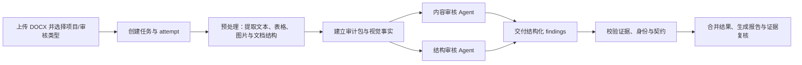

# DocGuard

DocGuard 是面向技术设计文档的智能审核平台。它将规范要求、DOCX 解析、专项 Agent 审核和证据复核整合到同一条可追溯链路中，帮助审核人员更快发现技术架构、部署容量、图文一致性、文档结构与格式等风险，并输出可复核的整改建议。

当前一期内置“技术架构报告审核”类型，适用于概要设计等 DOCX 技术文档；审核类型、规则包和 Agent 均为版本化配置，可按同一框架扩展至详细设计、测试方案等场景。

## 系统整体架构


## 核心能力

- **项目化审核工作台**：在首页统一管理项目，从“文档审核”发起任务，在“任务队列”按项目或文件名跟踪进度。
- **后端无关的多智能体审核**：默认技术架构审核由内容审核 Agent 与结构审核 Agent 并行交付，分别覆盖技术内容/架构合规性和文档结构/格式问题；可选择 DSH 或 OpenClaw 作为审核后端，单次运行只启用其中一个，平台以相同契约统一汇总结果。
- **证据驱动结论**：每个问题必须绑定段落、表格或图片证据，并附原文摘录、解释和可选定位信息，避免只有结论、无法核验。
- **可视化证据复核**：任务详情支持打开证据抽屉，查看命中的原文、表格单元格或渲染后的图件及区域标记。
- **标准化报告**：程序依据经过校验的结构化 Finding 生成 Markdown 报告，而非让模型直接自由生成最终报告。
- **规则透明可维护**：审批规则以 Markdown 文件维护，可在页面“审批规则”中按章节阅读；审核 Skill 与规则包可独立迭代。
- **可恢复任务链路**：Agent/Gateway 连接中断后任务进入 `collecting`，可继续收集已交付工件或恢复既有会话。

## 工作流程



1. 用户上传 `.docx` 文件，选择所属项目和审核类型。
2. 平台创建任务及本次 `attempt`，冻结审核类型、审核 Profile 和 Agent 定义快照，保证结果可追溯、可复跑。
3. 预处理器抽取文档段落、表格、嵌入对象和图片；必要时将图件转换为 PNG，并生成文本审计上下文、证据索引及视觉输入。
4. 专项 Agent 基于同一审计包并行审核，只写入其被授权的结构化 Finding 工件。
5. 平台校验工件元数据、Agent 身份、输入哈希、规则维度和每条证据引用；通过后才合并并渲染报告。
6. 审核人员在任务详情中查看问题、风险等级、整改建议及对应证据，或下载 Markdown 报告。

## 证据与 Finding 契约

证据不是报告中的附注，而是审核结论的必要组成。预处理阶段生成：

- `audit-context.md`：便于 Agent 阅读的文档结构与内容上下文；
- `audit-evidence.json`：稳定的段落、表格、图片证据索引；
- `evidence/rendered/`：可由前端受控访问的 PNG 图件；
- `work/vision-responses/`：逐图视觉模型的原始响应。

[Finding 模型](src/docguard/domain/models.py#L131) 使用 `evidence_refs` 引用 `block:<index>`、`table:<index>` 或 `image:<id>`，并包含原文摘录和解释。表格可指定行列选择器，图件可指定归一化区域。平台会验证引用 ID 和摘录是否真实存在于当前审计包；无效、未知或未完成写入的结果不会进入报告。

平台以交付目录为结果汇聚边界：读取其中所有完成态的 `*.findings.json` 文件，逐一校验工件元数据、Agent 身份、输入哈希、审核维度以及 Finding 和证据契约；校验通过后合并全部文件中的 Findings，并统一展示在任务详情和最终报告中。Agent 应先写入临时文件，并在本地校验通过后原子重命名为 `*.findings.json`；临时文件及其他文件名不会被读取或展示。

```json
{
  "evidence_id": "table:35",
  "role": "primary",
  "quote": "数据中台 | 数管平台",
  "explanation": "表中的系统简称与正文使用的名称不一致。",
  "selector": {
    "row_match": {"系统全称": "数据中台"},
    "columns": ["系统全称", "系统简称"]
  }
}
```

## 审核 Agent 与扩展方式

当前 `technical-architecture@1.0.0` 审核类型默认包含以下两个专项 Agent：

| Agent | 维度 | 职责 |
| --- | --- | --- |
| `content-reviewer` | `content` | 审核技术内容、架构、部署、容量、图文一致性和文档完整性。 |
| `structure-reviewer` | `structure` | 审核文档结构与格式。 |

多智能体设计与具体审核后端解耦：DSH 和 OpenClaw 都按照“并行专项审核 + 工件汇聚”模式交付，运行时根据配置二选一，而非共同参与同一次审核。每个 Agent 只能将结果原子写入自己的 `findings/<dimension>[.<scope>].findings.json`，平台只扫描完成态的 `*.findings.json`，并对 task、attempt、输入哈希、维度和注册身份进行交叉校验。

新增审核类型时，复用现有的 DOCX 提取、证据协议、任务、报告和复核界面；只需新增或配置规则包、Skill、Agent 定义与审核类型关联。具体交付约束见 [doc-audit-integrate-skill/SKILL.md](doc-audit-integrate-skill/SKILL.md) 和 [tect-doc-structure-audit-skill/SKILL.md](tect-doc-structure-audit-skill/SKILL.md)。

## 运行模式

| 模式 | 用途 | 依赖 |
| --- | --- | --- |
| `stub` | 页面、API、存储和报告链路的本地冒烟验证 | 无模型密钥 |
| `dsh` | 可选审核后端；通过 DeepSeek Harness 以多智能体模式执行审核 Skill | `MINIMAX_CN_API_KEY` 及 DSH 配置 |
| `openclaw` | 可选审核后端；通过 OpenClaw Gateway 以多智能体模式调度受限审核 Agent | Gateway、Token、模型配置与共享工件目录 |
| `langchain` | 兼容性图执行路径 | 对应模型配置 |

`dsh` 与 `openclaw` 是互斥的审核后端选项；通过 `DOCGUARD_DEFAULT_AGENT_BACKEND` 选择其一。无论选择哪种后端，内容审核和结构审核均按同一套多智能体 Finding 契约交付。

视觉审核使用兼容 OpenAI API 的视觉模型；当前默认配置为 DashScope/Qwen，可通过环境变量调整。生产场景建议对每个任务保留输入哈希、Profile/规则/Skill 版本、模型引用、审计包 manifest 和原始视觉响应 URI。

## 快速开始（本地开发）

前置条件：Python 3.12+ 与 [uv](https://docs.astral.sh/uv/)。完整 DOCX 预处理需要 Linux 工具链；Windows 开发环境可通过 WSL 调用 LibreOffice 和 Poppler。

```bash
uv sync --group dev
uv run python init/apply_sql.py --database-path ./data/docguard.sqlite3
uv run fastapi dev src/docguard/api/app.py
```

打开 <http://127.0.0.1:8000> 即可进入工作台。

初始化脚本是显式运维步骤：它创建 SQLite 数据库、表、索引、项目和初始审核类型；应用启动时只连接已经准备好的数据库。详情见 [init/README.md](init/README.md)。


## 配置

将根目录的 `.env.example` 复制为 `.env`，再按部署环境填写密钥和路径。常用变量如下：

| 变量 | 说明 |
| --- | --- |
| `DOCGUARD_DEFAULT_AGENT_BACKEND` | 默认执行后端，通常为 `dsh`。 |
| `MINIMAX_CN_API_KEY` | DSH 审核所需模型密钥（Docker 环境见 `deploy/.env.example`）。 |
| `DASHSCOPE_API_KEY` | 启用 Qwen 视觉审核所需密钥。 |
| `OPENCLAW_GATEWAY_URL` / `OPENCLAW_API_TOKEN` | 使用 OpenClaw 后端时的 Gateway 地址与鉴权 Token。 |
| `DOCGUARD_RESULT_WRITE_ROOT` / `DOCGUARD_RESULT_AGENT_ROOT` | 应用与 Agent 对同一审核工件目录的两种路径视图。 |
| `DOCGUARD_UPLOAD_WRITE_ROOT` / `DOCGUARD_UPLOAD_AGENT_ROOT` | 应用与 Agent 对上传文件目录的两种路径视图。 |
| `DOCGUARD_PREPROCESS_COMMAND` | Linux/容器中使用 `bash`；Windows + WSL 开发时使用 `wsl.exe`。 |

不要提交 `.env`、API Key、Gateway Token 或运行目录。上传文件、SQLite、日志和审核工件均属于持久化数据。

## Docker 部署

仓库提供单机 Linux Docker Compose 部署，运行状态统一保存在 `deploy/runtime/`：

```bash
cp deploy/.env.example deploy/.env
mkdir -p deploy/runtime
sudo chown -R 10001:10001 deploy/runtime
chmod 750 deploy/runtime

# 编辑 deploy/.env，填入实际密钥、路径与 Token
docker compose --env-file deploy/.env -f deploy/compose.yaml build docguard
docker compose --env-file deploy/.env -f deploy/compose.yaml run --rm --no-deps \
  docguard /app/.venv/bin/python /app/init/apply_sql.py \
  --database-path /var/lib/docguard/docguard.sqlite3
docker compose --env-file deploy/.env -f deploy/compose.yaml up -d
curl -fS http://127.0.0.1:8000/healthz
```

- Ubuntu 服务器完整部署与升级：[docs/docker-deploy-server.md](docs/docker-deploy-server.md)

## 项目结构

```text
src/docguard/
├── api/                  # FastAPI 接口、运营工作台与审批规则阅读器
├── adapters/             # DSH、OpenClaw、Stub、LangChain 执行器
├── domain/               # 版本化领域模型与 Finding 契约
├── graph/                # 兼容性工作流图
└── services/             # 任务、预处理、工件、证据、报告、项目与存储服务
init/                     # 显式数据库初始化 SQL 与脚本
deploy/                   # Docker 镜像、Compose 与运行时路由配置
doc-audit-integrate-skill/# 技术架构审核 Skill、规则与契约
tect-doc-structure-audit-skill/ # 文档结构与格式审核 Skill
tests/                    # 工作流、契约、接口与预处理回归测试
docs/                     # 背景、部署、运维与扩展文档
```
