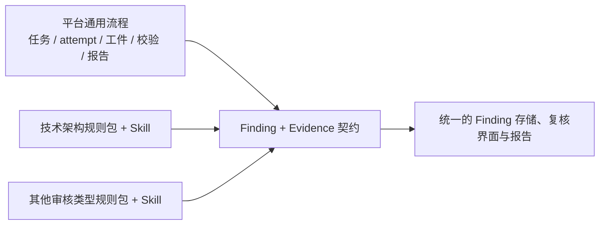
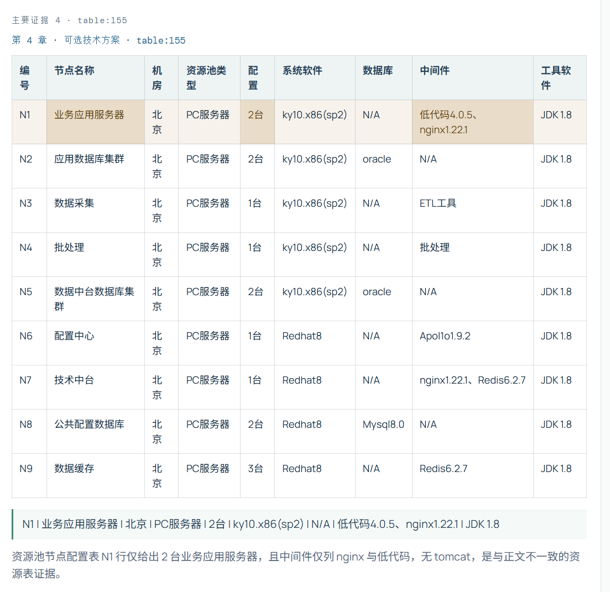
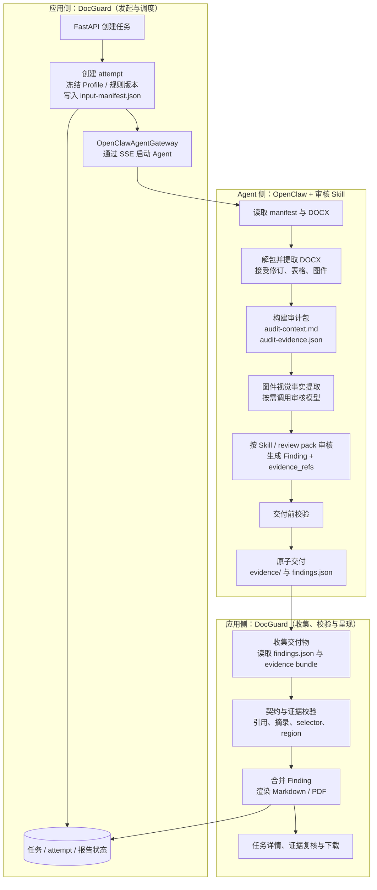

# DocGuard

## 设计思路

面向 DOCX 技术文档的证据驱动审核服务骨架。

处理流程：

1. 【Agent】执行脚本，将docx 文档解包，利用linux LibreOffice 将visio对象转pdf再栅格化为高精度png（extract_docx_structure.py)，预处理过的内容如下：
   ```text
   ./work
   ├── ./work/audit-context.md
   ├── ./work/audit-evidence.json
   ├── ./work/extracted
   │   ├── ./work/extracted/document-structure.json
   │   ├── ./work/extracted/embeddings
   │   │   ├── ./work/extracted/embeddings/oleObject1.bin
   │   │   ├── ./work/extracted/embeddings/oleObject13.bin
   │   │   ├── ./work/extracted/embeddings/oleObject3.bin
   │   │   ├── ./work/extracted/embeddings/oleObject4.bin
   │   │   ├── ./work/extracted/embeddings/oleObject7.bin
   │   │   └── ./work/extracted/embeddings/oleObject9.bin
   │   ├── ./work/extracted/media
   │   │   ├── ./work/extracted/media/image10.emf
   │   │   ├── ./work/extracted/media/image14.emf
   │   │   ├── ./work/extracted/media/image3.emf
   │   │   ├── ./work/extracted/media/image5.emf
   │   │   ├── ./work/extracted/media/image6.emf
   │   │   └── ./work/extracted/media/image8.emf
   │   └── ./work/extracted/rendered (所有图片渲染为png)
   │       ├── ./work/extracted/rendered/image-0c6494f30b864b08.png
   │       ├── ./work/extracted/rendered/image-37bba1471c9829bc.png
   │       ├── ./work/extracted/rendered/image-3c8e0c86d3eab436.png
   │       ├── ./work/extracted/rendered/image-6874fc73fe63d8cc.png
   │       ├── ./work/extracted/rendered/image-de2cbb75a0bcd333.png
   │       └── ./work/extracted/rendered/image-edf49e27f6407c0e.png
   ├── ./work/vision-prompt.txt
   └── ./work/vision-responses (视觉理解应答)
       ├── ./work/vision-responses/image-0c6494f30b864b08.raw.txt
       ├── ./work/vision-responses/image-37bba1471c9829bc.raw.txt
       ├── ./work/vision-responses/image-3c8e0c86d3eab436.raw.txt
       ├── ./work/vision-responses/image-6874fc73fe63d8cc.raw.txt
       ├── ./work/vision-responses/image-de2cbb75a0bcd333.raw.txt
       └── ./work/vision-responses/image-edf49e27f6407c0e.raw.txt
   ```

2. 构建视觉提示词，架构图降维为json

3. 构建 audit-context， 文本化表示整个docx的结构、内容；

4. 依据skill 里的审核规则，audit-context， 生成结构化审批意见（findings）

5. 结束 与应用的sse 会话，应用从指定路径获取findings，evidence，渲染审核报告；


## 设计亮点

### 1. Evidence-first

DocGuard 不把证据当作报告中的装饰文本，而是把它作为审核结果的第一等数据。Skill 在审核前将 DOCX 拆解为可引用的审计包：`audit-context.md` 提供可读上下文，`audit-evidence.json` 提供稳定的 block、表格和图片 ID，渲染后的图件保存在同一 attempt 中。Finding 通过 `evidence_refs` 指向 `block:<index>`、`table:<index>` 或 `image:<id>`，并携带原文摘录、解释，以及可选的表格单元格选择器或图片区域。指定输出内容（finding）必须包含evidence字段和详细信息，输出内容有专门的校验脚本检查，如果不输出则会校验失败，提示信息返回agent继续工作。

例如，审计包中的一段表格证据和 Finding 中的引用可以一一对应：

```json
// audit-evidence.json：原始、可定位的文档内容
{
  "block_index": 35,
  "type": "table",
  "rows": [
    ["系统全称", "系统简称"],
    ["数据中台", "数管平台"]
  ]
}

// findings.json：审核结论对该证据的引用
{
  "evidence_id": "table:35",
  "role": "primary",
  "quote": "数据中台 | 数管平台",
  "explanation": "该表将“数据中台”简称为“数管平台”，与正文中的系统名称不一致。",
  "selector": {
    "row_match": {"系统全称": "数据中台"},
    "columns": ["系统全称", "系统简称"]
  },
  "region": null
}
```

应用据此校验 `quote` 是否来自 `table:35`，并在证据阅读器中准确高亮对应行和单元格。段落证据使用 `block:<index>`，图件证据使用 `image:<id>`；后者可通过归一化的 `region` 标出图中的具体区域。


### 2. Finding 契约

Skill 负责判断，程序负责接受与呈现。

`finding-v1` 是平台和所有审核 Skill 之间的稳定边界。它统一定义了规则标识、分类、判定、严重性、置信度、问题描述、影响、修订建议、验收标准、根因键及证据引用等字段；Skill 只能按此结构原子交付 `findings.json`，不得直接生成最终 Markdown/PDF 报告，也不得私自扩展字段。

这份契约在两端同时落地，而不是只写在提示词里：

- **Skill 端**：[`finding-contract.md`](doc-audit-integrate-skill/references/finding-contract.md) 规定必填字段、枚举值、证据引用及定位语义，并通过交付前校验脚本阻止无效工件。
- **程序端**：[`Finding`](src/docguard/domain/models.py) 使用 Pydantic 固化同一 schema 与值域，工件收集器再结合实际 evidence bundle 做二次校验、合并与渲染。

双侧约束使 Skill 可以独立演进审核规则，而平台仍能稳定地存储、去重、展示、下载并回归测试所有审核类型的结果；`evidence_ids` 保留兼容读取，新的可定位体验则以 `evidence_refs` 为准。

### 3. 框架与业务解耦

平台主流程只处理任务生命周期、attempt、工件收集、契约校验、Finding 合并和报告渲染；它不理解某一类文档应检查什么。具体业务规则放在 review pack 和 Skill 中，审核类型通过版本化的 `ReviewTypeDefinition` 绑定 Agent/skill、规则包、视觉策略、核心契约版本和 `AuditProfile`。创建任务时冻结完整定义与 Profile 快照，使同一输入可以按当时的规则和提示词版本重跑、追溯。



新增审核类型的主要工作是增加规则包和符合契约的 Skill，而不是复制 API、存储、证据阅读器或报告链路，基础设施升级为队列、对象存储或 PostgreSQL 时不改变审核业务语义。

### 4. 证据渲染

效果图：



## 技术架构



### 分层职责

| 层 | 职责 | 当前实现 | 生产替换 |
| --- | --- | --- | --- |
| FastAPI | 创建任务、查询状态、鉴权、展示下载 | `api/app.py` | 保持接口，补鉴权与分页 |
| Worker | 领取长任务、重试、限流、租约 | FastAPI `BackgroundTasks` 演示实现 | 独立 worker + Redis/RabbitMQ/云队列 |
| 审计 Skill | 接受修订、DOCX/表格/图件提取、建立审计包与审核 | OpenClaw Agent | 受限运行时 + 独立审计包存储 |
| OpenClaw 调度器 | 启动 artifact-delivered attempt 并记录 Gateway SSE | `OpenClawAgentGateway` | 队列 worker + 重试 |
| 工件收集 | 读取并校验 `findings.json` | 共享 WSL 目录 | 对象存储事件/队列 |
| 存储 | 任务元数据、状态、Finding 与报告 | SQLite `data/docguard.sqlite3` | PostgreSQL + S3/MinIO |
| 报告 | Findings 渲染及下载 | Markdown | 固定模板 Markdown/PDF |

在 OpenClaw 分支中，Agent 只负责提取、理解、审核和交付结构化工件；应用只负责启动与跟踪任务、接受工件、校验证据、合并结果和生成报告。模型不直接输出最终报告，应用也不承担具体审核规则判断。

## 核心数据契约

`ReviewTypeDefinition` 是平台可选报告审核类型的版本化元数据，保存于 SQLite；应用启动时加载启用类型，主页以下拉框展示。它绑定 OpenClaw Agent/skill、规则包、视觉策略与核心契约版本。创建任务时会冻结完整定义和 `AuditProfile` 快照，保证重跑可复现。

所有审核类型必须共用 DOCX 提取、`audit-context.md`、`audit-evidence.json` 和严格的 `Finding` 契约。类型扩展仅增加 Agent/skill 和规则包，不能分叉证据或结果协议。技术架构审核是内置种子类型；工程师可参考 [`报告审核 Agent 扩展模板`](docs/report-review-skill-template.md) 创建新 skill。

OpenClaw Agent 负责提取 DOCX、建立审计包并生成可定位证据。新 `Finding` 使用结构化 `evidence_refs` 引用审计包中的 block、表格或图片；应用校验引用 ID、原文摘录、表格选择器与图片区域，并在任务详情中展示可复核的原文/图件。兼容既有 `evidence_ids`，但旧工件不会获得新证据阅读器的定位能力。

建议生产环境为每个任务冻结：输入文件哈希、Profile 快照、提示词版本、模型引用、审计包 manifest、运行 ID 和原始模型响应 URI。

### Artifact 交付路径

OpenClaw attempt 使用应用与 Agent 共享的结果根目录。应用侧通过 `DOCGUARD_RESULT_WRITE_ROOT` 配置该目录，默认值为 `\\wsl.localhost\\Ubuntu\\home\\ubuntu\\docguard-results`；Agent 侧通过 `DOCGUARD_RESULT_AGENT_ROOT` 使用对应的 WSL 路径，默认值为 `/home/ubuntu/docguard-results`。每次任务和 attempt 的目录结构固定如下：

```text
<result-root>/
└── <task_id>/
    └── <attempt_id>/
        ├── input-manifest.json
        ├── findings.json
        └── evidence/
            ├── audit-evidence.json
            └── rendered/
                └── *.png
```

`input-manifest.json` 由应用创建；`audit-evidence.json` 和 `rendered/` 由 OpenClaw Skill 交付；`findings.json` 是 Agent 最终交付的结构化结果。Agent 必须先写入同目录临时文件并校验成功，再通过原子重命名交付 `findings.json`。应用检测到该文件后，读取同一 attempt 下的 `evidence/audit-evidence.json`，校验 `evidence_refs` 是否引用真实证据，最后合并 Finding 并生成报告。

证据引用只能使用当前审计包中的 `block:<block_index>`、`table:<block_index>` 或 `image:<image_id>`。图片文件必须位于该 attempt 的 `evidence/rendered/` 目录内；应用不会把内部文件路径直接暴露给浏览器，而是通过证据接口生成受控图片 URL。完整交付约束见 [`doc-audit-integrate-skill/SKILL.md`](doc-audit-integrate-skill/SKILL.md)。

## 快速开始

需安装 [uv](https://docs.astral.sh/uv/) 和 Python 3.12+。

```bash
uv sync --group dev
uv run fastapi dev src/docguard/api/app.py
```

创建任务：

```bash
curl -X POST http://127.0.0.1:8000/api/v1/tasks \
  -H "Content-Type: application/json" \
  -d '{"review_type_id":"technical-architecture","document":{"filename":"方案.docx","content_sha256":"<64位SHA256>","source_uri":"s3://audit-input/方案.docx"}}'
```

运行检查：

```bash
uv run pytest
uv run ruff check .
```

### OpenClaw 安全边界

审核 worker 应当给 OpenClaw 最小工具权限：只读指定审计包与图件、仅允许调用审核模型、仅可写入指定结果目录。不要默认暴露 shell、浏览器、消息发送、任意文件写入或外网写能力。

## 项目结构

```text
src/docguard/
├── api/          # FastAPI 控制面
├── adapters/     # OpenClaw/LangChain/Stub 执行器
├── domain/       # 版本化数据契约
├── graph/        # LangGraph 工作流
└── services/     # Profile、存储、任务、报告
tests/            # 最小工作流回归测试
```

