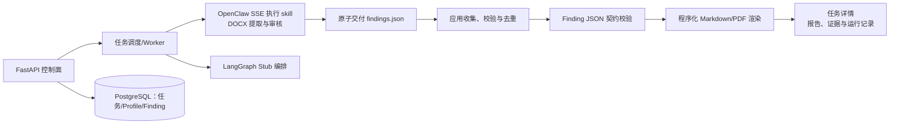
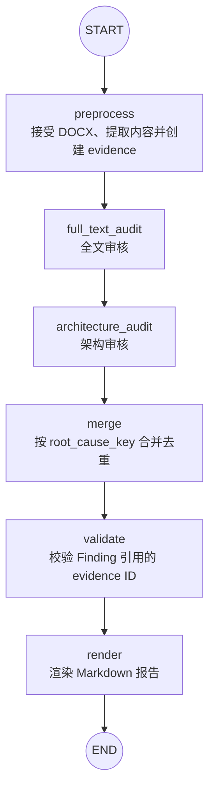

# DocGuard

面向 DOCX 技术文档的证据驱动审核服务骨架。它坚持一条边界：**agent 只输出结构化审核判断 `Finding[]`；程序负责文件处理、流程控制、证据校验与最终报告。**

当前版本默认使用确定性的 `stub` 审核执行器。`openclaw` 后端通过 Gateway 的 OpenResponses SSE 启动长任务，Agent 将结构化结果原子写入共享 `findings.json`，应用随后校验并渲染报告。

## 技术架构



### 分层职责

| 层 | 职责 | 当前实现 | 生产替换 |
| --- | --- | --- | --- |
| FastAPI | 创建任务、查询状态、鉴权、展示下载 | `api/app.py` | 保持接口，补鉴权与分页 |
| Worker | 领取长任务、重试、限流、租约 | FastAPI `BackgroundTasks` 演示实现 | 独立 worker + Redis/RabbitMQ/云队列 |
| LangGraph | 节点编排、失败恢复、人工暂停恢复 | `graph/audit_graph.py` | `PostgresSaver` checkpoint |
| 审计 Skill | 接受修订、DOCX/表格/图件提取、建立审计包与审核 | OpenClaw Agent | 受限运行时 + 独立审计包存储 |
| AgentGateway | 启动审核并记录 Gateway SSE | Stub/OpenClaw/LangChain 接口 | 队列 worker + 重试 |
| 工件收集 | 读取并校验 `findings.json` | 共享 WSL 目录 | 对象存储事件/队列 |
| 存储 | 元数据、产物与原始响应 | 内存 store | PostgreSQL + S3/MinIO |
| 报告 | Findings 渲染及下载 | Markdown | 固定模板 Markdown/PDF |

LangGraph 负责同步的 Stub 编排；OpenClaw 负责审核判断和工件交付；校验器和渲染器负责什么结果可接受以及如何呈现。不要让模型直接输出最终报告。

### 审核图（`src/docguard/graph/audit_graph.py`）



## 核心数据契约

`AuditProfile` 规定必经节点、证据策略、提示词及模板版本。创建任务时会拷贝为任务快照，保证重跑可复现。

OpenClaw Agent 负责提取 DOCX、建立审计包并生成可定位证据。`Finding` 必须携带一个或多个由该审计包生成的 `evidence_ids`；应用只校验 `Finding` JSON 契约、任务元数据与根因去重，不重建或白名单校验证据包。

建议生产环境为每个任务冻结：输入文件哈希、Profile 快照、提示词版本、模型引用、审计包 manifest、运行 ID 和原始模型响应 URI。

## 快速开始

需安装 [uv](https://docs.astral.sh/uv/) 和 Python 3.12+。

```bash
uv sync --group dev
uv run fastapi dev src/docguard/api/app.py
```

创建任务：

```bash
curl -X POST http://127.0.0.1:8000/api/v1/tasks \
  -H "Content-Type: application/json" \
  -d '{"document":{"filename":"方案.docx","content_sha256":"<64位SHA256>","source_uri":"s3://audit-input/方案.docx"},"agent_backend":"stub"}'
```

运行检查：

```bash
uv run pytest
uv run ruff check .
```

## 接入真实审核能力

1. OpenClaw skill 负责接受修订后的 DOCX、建立审计包和生成证据；生产环境应将其工作目录与审计包保留策略纳入对象存储和审计日志。
2. `OpenClawAgentGateway` 已通过 `POST /v1/responses` 的 SSE 启动审核，并保存 Gateway response ID；生产 worker 应在 SSE 中断后进入 `collecting` 并轮询该 attempt 的结果工件，而非立即重发。
3. 实现 `LangChainAgentGateway`：使用模型的结构化输出能力将输出直接反序列化为 `Finding[]`，禁止返回 Markdown。
4. 将 `InMemoryTaskStore` 替换为 PostgreSQL；将 `BackgroundTasks` 替换为独立队列 worker，并周期性调用 `collect_pending()`；为 LangGraph 配置持久化 checkpointer 和保留策略。
5. 补充人工复核节点、任务级重跑、RBAC、对象存储签名访问、评测集及可观测性。

### OpenClaw 安全边界

审核 worker 应当给 OpenClaw 最小工具权限：只读指定审计包与图件、仅允许调用审核模型、仅可写入指定结果目录。不要默认暴露 shell、浏览器、消息发送、任意文件写入或外网写能力。

## 项目结构

```text
src/docguard/
├── api/          # FastAPI 控制面
├── adapters/     # OpenClaw/LangChain/Stub 执行器
├── domain/       # 版本化数据契约
├── graph/        # LangGraph 工作流
└── services/     # Profile、存储、任务、报告
tests/            # 最小工作流回归测试
```

## 当前边界

该仓库是框架而不是完整 DOCX 审核产品。DOCX 接受修订、解析、渲染、PDF 输出、数据库、对象存储、队列与真实模型调用尚未实现；它们都已经有明确的扩展位置，且不会破坏已固定的任务、证据、finding 和报告边界。
