# 多智能体数据模型（ER 图）

下图描述的是领域对象、任务快照与结果工件之间的**逻辑关系**，并非 SQLite 物理表的逐表映射。SQLite 中 `AuditTask` 以 JSON `payload` 持久化完整对象树；图中标记为 `FK` 的字段表示逻辑引用或工件校验键。

`ReviewTypeDefinition` 内嵌 `AuditProfile`，并通过 `REVIEW_TYPE_AGENT_REGISTRATION` 注册可被多个审核类型复用的 `AuditAgentDefinition`。该桥接实体对应 SQLite 表 `review_type_agent_definitions`。创建任务时，审核类型、Profile 和 Agent 配置都会被冻结；之后每个 attempt 按冻结的 Agent 列表创建独立运行。

```mermaid
erDiagram

    PROJECT ||--o{ AUDIT_TASK : contains
    REVIEW_TYPE ||--|| AUDIT_PROFILE : embeds
    REVIEW_TYPE ||--o{ REVIEW_TYPE_AGENT_REGISTRATION : has
    AUDIT_AGENT_DEFINITION ||--o{ REVIEW_TYPE_AGENT_REGISTRATION : assigned_by

    REVIEW_TYPE ||..o{ AUDIT_TASK : frozen_into
    AUDIT_PROFILE ||..o{ AUDIT_TASK : frozen_into
    AUDIT_TASK ||--|| INPUT_DOCUMENT : reviews
    AUDIT_TASK ||--o{ AUDIT_ATTEMPT : retries_as

    AUDIT_ATTEMPT ||--o{ AGENT_RUN : dispatches
    AUDIT_AGENT_DEFINITION ||..o{ AGENT_RUN : snapshotted_as
    AGENT_RUN ||--o| AGENT_RESULT : delivers

    AGENT_RESULT ||--o{ FINDING : contains
    FINDING ||--o{ EVIDENCE_REF : cites

    PROJECT {
        string projectId PK
        string name
        string description
        string owner
        string status
        datetime createdAt
        datetime updatedAt
    }

    REVIEW_TYPE {
        string reviewTypeId PK
        string version PK
        string displayName
        string description
        string skillRef
        int coreContractVersion
        string rulePackRef
        string rulePackVersion
        json visualPolicy
    }

    AUDIT_PROFILE {
        string profileId PK
        string version PK
        json requiredNodes
        string reportTemplate
        string evidencePolicy
        json promptVersions
    }

    AUDIT_AGENT_DEFINITION {
        int agentDefinitionPk PK "SQLite surrogate key"
        string agentId UK
        string version UK
        string dimension
        string scope "Nullable"
        string agentBackend
        string agentModelRef
        string skillRef
        string rulePackRef
        string rulePackVersion
    }

    REVIEW_TYPE_AGENT_REGISTRATION {
        string reviewTypeId PK, FK
        string reviewTypeVersion PK, FK
        int agentDefinitionPk PK, FK
        int position "Execution and display order"
    }

    AUDIT_TASK {
        string taskId PK
        string projectId FK
        string status
        string reviewTypeId FK "Frozen snapshot key"
        string reviewTypeVersion FK
        string profileId FK "Frozen snapshot key"
        string profileVersion FK
        string agentBackend
        datetime createdAt
        datetime updatedAt
        string error "Nullable"
        string reportMarkdown "Nullable"
        string checkpointThreadId "Nullable"
    }

    INPUT_DOCUMENT {
        string taskId PK, FK "Owned by task"
        string filename
        string contentSha256
        string sourceUri
    }

    AUDIT_ATTEMPT {
        string attemptId PK
        string taskId FK "Logical owner"
        string status
        datetime createdAt
        datetime updatedAt
        string inputManifestUri
        string resultUri
        string inputSha256
        string gatewayResponseId "Nullable"
        string error "Nullable"
    }

    AGENT_RUN {
        string attemptId FK "Logical owner"
        string agentId FK "Frozen definition"
        string agentVersion FK
        string dimension
        string scope "Nullable"
        string resultUri
        string executionBackend "Nullable"
        string status
        string gatewaySessionId "Nullable"
        string gatewayResponseId
        string workspacePath "Nullable"
        string error "Nullable"
    }

    AGENT_RESULT {
        string taskId FK
        string attemptId FK
        string schemaVersion
        string inputSha256
        string profileId FK
        string profileVersion FK
        string reviewTypeId FK
        string reviewTypeVersion FK
        int coreContractVersion
        string dimension
        string scope "Nullable"
        string producerAgentId
        string producerAgentVersion
        string producerModelRef
    }

    FINDING {
        string findingId PK
        string schemaVersion
        string ruleId
        string category
        string reviewDimension
        string severity
        string judgment
        float confidence
        string title
        json textEvidence
        json imageEvidence
        string problemDescription
        string impact
        string revisionSuggestion
        string revisionLocation
        string completionCriteria
        json evidenceIds
        string rootCauseKey
        string agentBackend
    }

    EVIDENCE_REF {
        string findingId FK "Logical owner"
        string evidenceId FK "Evidence bundle item"
        string role
        string quote
        string explanation
        json selector "Text or table only"
        json region "Image only"
    }
```



## 关键关系

- **项目与任务**：一个 `Project` 可包含多个 `AuditTask`，每个任务必须且永久归属一个项目；`projectId` 是持久化层真实外键。
- **审核类型、Profile 与 Agent**：一个 `ReviewTypeDefinition` 内嵌一个 `AuditProfile`，并可通过桥接实体注册多个 `AuditAgentDefinition`；同一 Agent 定义也可被多个审核类型复用，因此两者是多对多关系。桥接实体的 `position` 固化执行及展示顺序。`dimension` 是报告中的稳定一级分类，`scope` 是可选细分分类。
- **任务快照**：`AuditTask` 保存审核类型、Profile 和其中 Agent 定义的完整快照。图中的快照键用于表达来源及可追溯关系，并不表示任务运行时再去读取当前注册表。
- **尝试与运行**：任务可有零到多个 `AuditAttempt`；每个 attempt 按冻结的 Agent 列表创建 `AgentRun`。`AgentRun` 没有独立 ID，由所属 attempt 与冻结的 `(agentId, agentVersion)` 在上下文中识别，并记录执行后端、会话、工作目录、状态、错误与专属结果路径。
- **结果工件**：每个 `AgentRun` 在完成前可以没有结果，完成后最多原子交付一个 `AgentResult`：`findings/<dimension>[.<scope>].findings.json`。工件中的 task、attempt、输入摘要、Profile、审核类型、Agent、dimension 与 scope 会和运行上下文逐项交叉校验。
- **审核结论与证据**：`AgentResult` 包含零到多个统一契约的 `Finding`。每个 Finding 的 `evidenceIds` 至少包含一个证据标识，并可携带结构化 `EvidenceRef`；引用通过 `evidenceId` 指向当前 attempt 的证据包条目，而不是独立数据库记录。

## 关系字段说明

| 子实体 / 工件 | 关系字段 | 指向 | 约束含义 |
| --- | --- | --- | --- |
| `AuditTask` | `projectId` | `Project.projectId` | SQLite 真实外键，删除项目受限 |
| `ReviewTypeAgentRegistration` | 审核类型复合键 + `agentDefinitionPk` | `ReviewTypeDefinition / AuditAgentDefinition` | SQLite 多对多桥接关系，附带顺序 `position` |
| `AuditTask` | `reviewTypeId + reviewTypeVersion` | `ReviewTypeDefinition` | 冻结快照的来源版本 |
| `AuditTask` | `profileId + profileVersion` | `AuditProfile` | 冻结 Profile 的来源版本 |
| `AuditAttempt` | `taskId` | `AuditTask.taskId` | JSON 对象树中的逻辑父子关系 |
| `AgentRun` | `attemptId` | `AuditAttempt.attemptId` | 运行所属 attempt；逻辑关系字段 |
| `AgentRun` | `agentId + agentVersion` | `AuditAgentDefinition` | attempt 准备时冻结的 Agent 版本 |
| `AgentResult` | `taskId + attemptId` | `AuditTask / AuditAttempt` | 防止结果串任务或串重试 |
| `AgentResult` | Profile、ReviewType、Producer 字段 | 对应冻结快照 | 收集时必须与运行上下文完全一致 |
| `EvidenceRef` | `evidenceId` | attempt 证据包条目 | 可指向文本块、表格或候选图片 |

## 目录映射

```text
<task_id>/<attempt_id>/
├── input-manifest.json
├── findings/
│   ├── content.findings.json
│   └── architecture.deployment.findings.json
└── evidence/
    └── audit-evidence.json
```

`content.findings.json` 的结果 metadata 为 `dimension=content`、`scope=null`；`architecture.deployment.findings.json` 则为 `dimension=architecture`、`scope=deployment`。程序会将文件名、AgentRun 配置和结果 metadata 三者交叉校验。
