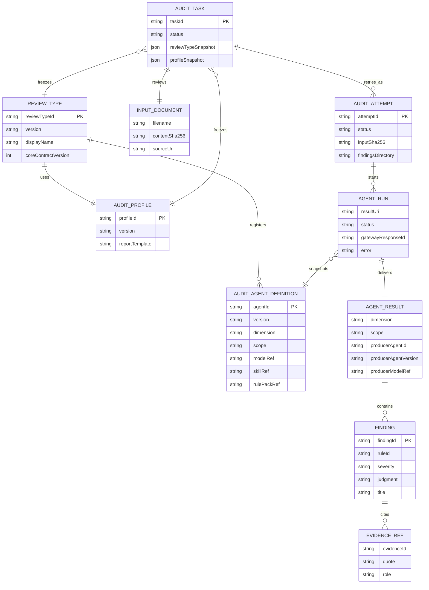

# 多智能体数据模型（ER 图）

 `ReviewTypeDefinition`、`AuditProfile` 与 `AuditAgentDefinition` 会在创建任务时冻结到 `AuditTask`。图中的实体名对应代码类名的大写形式。



## 关键关系

- **审核类型与 Agent**：一个 `ReviewTypeDefinition` 注册多个 `AuditAgentDefinition`。Agent 定义可独立注册；`dimension` 是报告中的稳定一级分类，`scope` 是可选的细分分类。
- **任务快照**：`AuditTask` 冻结审核类型和 Profile，避免后续配置变更影响历史任务的可追溯性。
- **尝试与运行**：任务可有多个 `AuditAttempt`；每个 attempt 为每个注册 Agent 建立一个 `AgentRun`，记录该 Agent 的 Gateway 会话、状态、错误与专属结果路径。
- **结果工件**：每个 `AgentRun` 原子交付一个 `AgentResult` 文件：`findings/<dimension>[.<scope>].findings.json`。只有匹配 `*.findings.json` 的最终文件会被扫描；临时文件不参与收集。
- **审核结论与证据**：`AgentResult` 包含统一契约的 `Finding[]`，每个 Finding 可引用一个或多个 `EvidenceRef`，对应当前 attempt 的证据包。

## 目录映射

```text
<task_id>/<attempt_id>/
├── input-manifest.json
├── findings/
│   ├── content.findings.json
│   └── architecture.deployment.findings.json
└── evidence/
    └── audit-evidence.json
```

`content.findings.json` 的结果 metadata 为 `dimension=content`、`scope=null`；`architecture.deployment.findings.json` 则为 `dimension=architecture`、`scope=deployment`。程序会将文件名、AgentRun 配置和结果 metadata 三者交叉校验。
